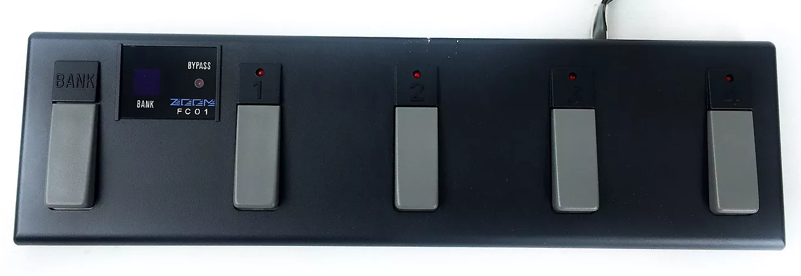
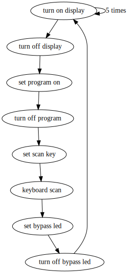
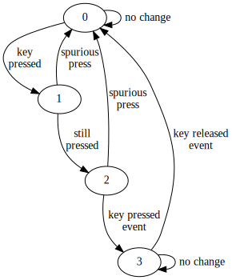

# # Zoom FC-01 modified to use with MIDI footswitch

This project modifies an old FC-01 foot switch in order to use it with MIDI devices

## Original Circuit

The original circuit is based on NEC 755A3001 controller and use a Zoom proprietary cable and interface

## New Circuit

The new circuit just pop off the NEC controller and the Zoom proprietary cable. Use a PIC16F872 instead, plugged on the original NEC's pins. A standard five pins DIN is mounted on a drilled hole on foot switch case.
An SMPS is provided in order to source 5 volts power. As there is no room to place batteries, an external power is necessary. This power can be provided by modified MID cable or by using a dedicated power plug. The external plug is connected to an internal diode bridge. Its is very interesting as the user will not to be bother about power plug polarity, even AC power can be plugged on.

## Display State Machine

## Keyboard State Machine

